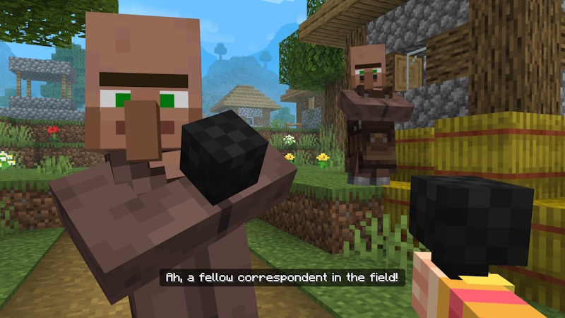
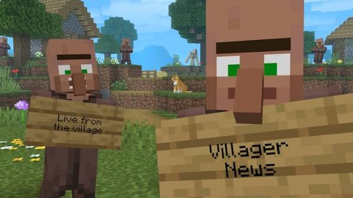

# Villager News Mod

**Villager News Mod** is the Villager News 1.0 add-on for Minecraft Bedrock, with Java notes. 2000+ voices, gossip, Oreville and Element Animation.

## What's new in v1.0 (September 3, 2026)
- Official Villager News 1.0 add-on
- 2000+ voiced reactions
- Gossip / reputation
- Minecraft 1.21.120+

## How to use
1. Download v1.0.
2. Extract `Villager-News-Mod.zip`.
3. Drop the pack into Bedrock (Java notes in `files/java/`).
4. Enable. Load a world.

## Key Features
- Villager News voices
- Bedrock add-on
- Java notes
- Gossip
- Actions and Stuff friendly

## FAQ

**Java?**
Notes in `files/java/`. Marketplace pack is Bedrock.

**Price on Marketplace?**
This zip is the pack notes. Enable after extract.

## Requirements
Minecraft 1.21.120 or later. Bedrock Marketplace path.

## License
Add-on notes - Copyright (C) 2026 villagernews

